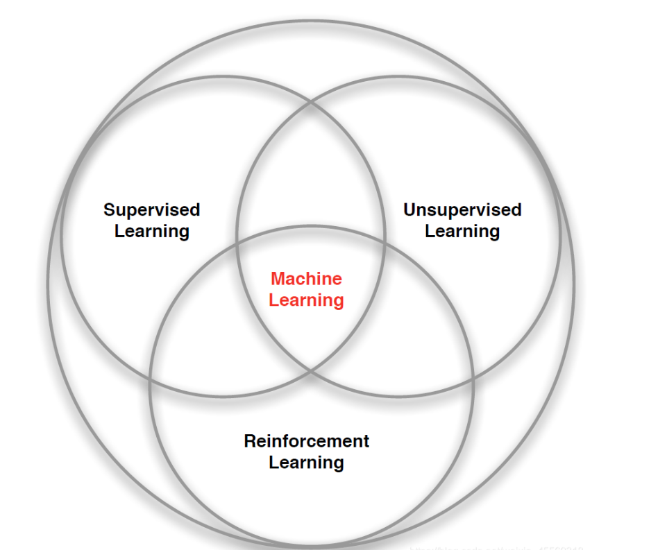

# Machine-Learning
机器学习、深度学习、强化学习整理
# 机器学习
> 机器学习主要分为三类：监督学习(Supervised learning)、无监督学习(Unsupervised learning)和强化学习(Reinforcement Learning)
- 机器学习就是让机器找一个函数的能力，找一个复杂的函数，满足输入有对应的输出，不同函数类型对应不同的形式。
- Regression:回归，输出是一个标量
- classfication:分类，给出选项，选出正确的一个。
- structed learning：结构学习。创造一些新的事物

## 机器学习过程
> 下述步骤是训练的过程：1.找出函数：具有特征和未知参数的函数；2.定义Loss函数；3.优化：求解最优未知参数
### 1.具有未知参数的function —— 定义神经网络
- model:y=f（?）——> y=b + wx;  W：权重 b:偏差
- 线性模型（linear model）：y=b + wx(单变量)
- piecewise learning（分段）：——>逼近曲线（多变量）；
  - $$y=b+\sum_{i}c_{i}sigmoid(b_{i}+w_{i}x) ; y=sigmoid(b_{i}+w_{i}x) 为分段函数；sigmoid=c\frac{1}{1+e^{-(b+wx_{1} )} } $$
- 线性整流函数（Rectified Linear Unit）：ReLU
  - $$c=max(0，b+wx_{1} ) $$
> sigmoid 和 ReLU 是最常见的激活函数；多层神经网络——>深度学习
### 2.定义Loss
- 关于 w 和 b 的 Loss函数：L(w,b)
- 损失函数越小，说明预测曲线相差越小，越大则说明损失越大；MAE（绝对值误差），MSE（平方误差）
### 3.优化 —— 优化算法
- 优化 w 和 b，选出最优的参数组合，w* b* = arg min(w,b) L
- 方法：梯度下降（梯度下降具有local minima局部最小值的问题）
- 超参数（自己设置）：学习率、batch size、
  
## 有监督学习——Supervised Learning
- 监督学习的训练集中，每一个样本都含有一个标签，在理想情况下，这个标签通常指代正确的结果。监督学习的任务即是让系统在训练集上按照每个样本所对应的标签推断出应有的反馈机制，进而在未知标签的样本上能够计算出一个尽可能正确的结果，例如我们熟悉的分类与回归问题。在强化学习中的交互问题中却并不存在这样一个普适正确的“标签”，智能体只能从自身的经验中去学习。

## 无监督学习——Unsupervised Learning
- 无监督学习是从无标签的数据集中发现隐藏的结构，典型的例子就是聚类问题。但是强化学习的目标是最大化奖励而非寻找隐藏的数据集结构，尽管用无监督学习的方法寻找数据内在结构可以对强化学习任务起到帮助，但并未从根本上解决最大化奖励的问题。

## 强化学习——Reinforcement Learning
- 无监督学习是从无标签的数据集中发现隐藏的结构，典型的例子就是聚类问题。但是强化学习的目标是最大化奖励而非寻找隐藏的数据集结构，尽管用无监督学习的方法寻找数据内在结构可以对强化学习任务起到帮助，但并未从根本上解决最大化奖励的问题。
