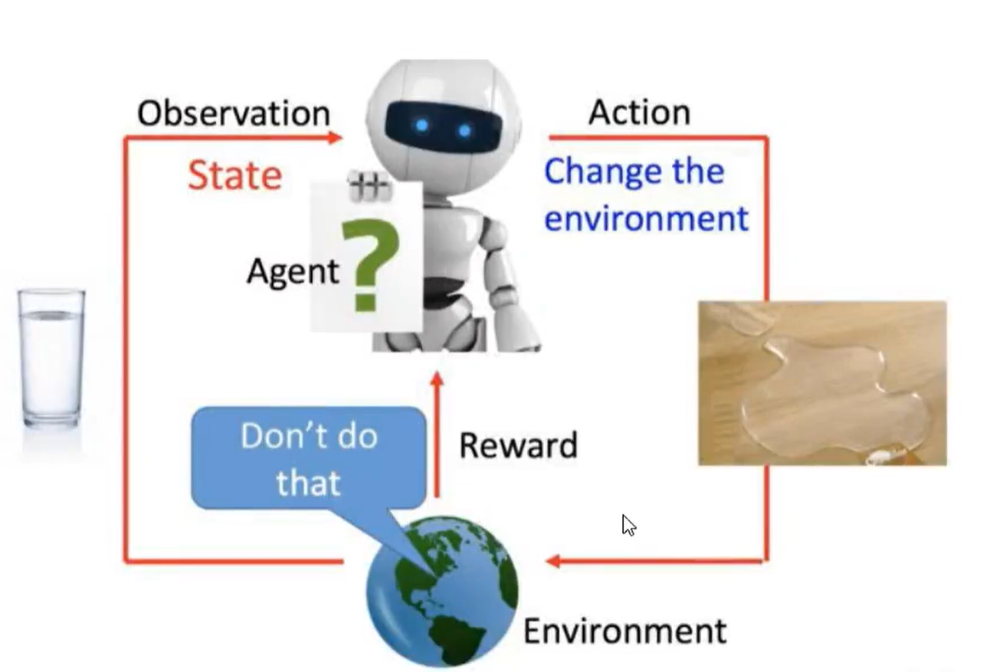

# 强化学习
# 一、基本概念
## 1.定义
* 强化学习（Reinforcement Learning, RL），又称再励学习、评价学习或增强学习，是机器学习的范式和方法论之一，用于描述和解决智能体（agent）在与环境的交互过程中通过学习策略以达成回报最大化或实现特定目标的问题。
  * 强化学习需要**智能体不断与环境进行交互**
  * 开局是瞎走，需要大量的模拟数据进行训练，训练其实就是不断尝试的过程，慢慢学习如何完成奖励最高的决策
## 2.过程

* 机器人（agent）不断与环境进行交互
* 互动就是得到下一步的指示（Action）
* 按照指示走下步势必会改变环境（Environment）
* 继续与环境交互得到新的指示（结合奖励机制进行学习）
# 二、PPO算法
